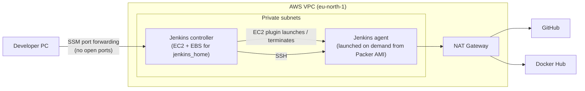

# Elistra Home Task

A CI/CD pipeline built with **Jenkins Job DSL**, running on AWS infrastructure provisioned with **Terraform** and **Packer**.

---

## Architecture



- **Everything runs in private subnets.** Nothing is reachable from the internet; outbound traffic goes through a NAT gateway.
- **Jenkins is reached through AWS SSM port forwarding**, so there is no bastion host, VPN or open inbound port.
- **The controller runs no builds** (0 executors). Builds run on **agents launched on demand** by the Jenkins EC2 plugin and terminated after 10 idle minutes, so no cost when nothing runs.
- **Agents start from a golden AMI** built with Packer (Java, Git, Docker, Compose preinstalled), so they are ready in about a minute.
- **`jenkins_home` lives on a separate EBS volume**, so credentials, plugins and configuration survive replacing the controller instance.

---

## Repository structure

```
.
├── infra/
│   ├── core/                 # Terraform: VPC, Jenkins controller, agent prerequisites
│   │   └── user_data/        # Controller bootstrap script
│   └── packer/               # Packer: golden AMI for Jenkins agents
└── jenkins/
    ├── seed.groovy           # Job DSL: creates the three pipeline jobs
    ├── pipelines/            # One Jenkinsfile per job
    ├── flask-app/            # Flask app that lists running containers
    ├── nginx-proxy/          # Nginx reverse proxy image
    └── deploy/               # docker-compose.yml used by the deploy job
```

---

## Part A – Jenkins jobs

### Jobs as code
`jenkins/seed.groovy` uses the **Job DSL plugin** to create three pipeline jobs. A single manual job (`seed-job`) runs it. Each generated job pulls this repository and runs its own Jenkinsfile from `jenkins/pipelines/`.

| Job | Jenkinsfile | What it does |
|---|---|---|
| `01-build-flask` | `Jenkinsfile.flask` | Build the Flask image → scan → push to Docker Hub |
| `02-build-nginx` | `Jenkinsfile.nginx` | Build the Nginx image → scan → push to Docker Hub |
| `03-deploy-verify` | `Jenkinsfile.deploy` | Run both containers → verify → clean up |

### The Flask app (`jenkins/flask-app`)
A small Flask app (served by gunicorn) that lists the containers running on the host, like `docker ps`.

| Endpoint | Returns |
|---|---|
| `/` | HTML table of running containers, plus the client IP received from Nginx |
| `/api/containers` | The same list as JSON |
| `/health` | `{"status": "ok"}` |

**Access to the Docker engine is restricted.** Mounting `/var/run/docker.sock` into an app gives it full control of the Docker engine, effectively root on the host. Instead, the app talks to a **[docker-socket-proxy](https://github.com/Tecnativa/docker-socket-proxy)** that only allows reading the container list:

```
Flask ──HTTP──▶ socket-proxy ──(read-only filter)──▶ docker.sock
```

- `CONTAINERS=1` allows `/containers` endpoints; `POST=0` blocks every write operation.
- The app needs no code change for this: the Docker SDK reads `DOCKER_HOST=tcp://socket-proxy:2375` from the environment.

### The Nginx reverse proxy (`jenkins/nginx-proxy`)
Built on the official image (`FROM nginx:1.30.5-alpine3.24`) with a custom `default.conf`:
- `proxy_pass http://flask-app:5000` forwards all traffic to the Flask container.
- `proxy_set_header X-Real-IP $remote_addr` (plus `X-Forwarded-For`) **injects the client's source IP**, which would otherwise be lost on the proxy hop. Nginx overwrites `X-Real-IP`, so a client cannot spoof it.

### Deploy and verify (`jenkins/deploy`)
Job 3 runs the stack with Docker Compose on the Jenkins agent:

| Container | Networks | Exposed |
|---|---|---|
| `socket-proxy` | backend (internal) | – |
| `flask-app` | backend, frontend | – |
| `nginx-proxy` | frontend | **`127.0.0.1:8080` only** |

- Nginx is published **only on the agent's loopback interface**, so it is reachable from the Jenkins machine and nowhere else.
- Only Flask can reach the socket proxy; the backend network has no route out of the host.
- Nginx starts only after Flask's healthcheck passes.

**Verification** (any failure fails the job):
1. Nginx's port is bound to `127.0.0.1:8080`.
2. `/health` answers **through Nginx**.
3. `/api/containers` lists `flask-app` and `nginx-proxy`, proving the app reads the Docker engine through the socket proxy.

The stack is always removed at the end of the job.

### Pipeline features
- **Security scan:** every image is scanned with **[Trivy](https://trivy.dev)** before it is pushed. A CRITICAL vulnerability with an available fix fails the build, so the image never reaches the registry. The image is passed to Trivy as a file (`docker save`), without giving the scanner access to the Docker socket.
  *Example:* the scan blocked an Nginx image based on `1.27-alpine` because of a critical OpenSSL CVE; moving to `1.30.5-alpine3.24` fixed it.
- **Semantic versioning:** each app has a `VERSION` file (e.g. `1.0.0`). Images are tagged with that version and `latest`. **A version can't be overwritten:** if the tag already exists on Docker Hub, the build fails and asks for a version bump.
- **Deploy what was built:** job 3 deploys the exact versions from the `VERSION` files, not `latest`. Specific versions can be deployed with the `FLASK_TAG` / `NGINX_TAG` parameters.
- **Secrets:** the Docker Hub token is stored in Jenkins Credentials, masked in logs, and passed with `--password-stdin`.
- **Cleanup:** built images and workspaces are removed after every build.

---

## Infrastructure

### Terraform (`infra/core`)
Uses the official [terraform-aws-modules](https://github.com/terraform-aws-modules) for the VPC and the EC2 instance.

| Resource | Details |
|---|---|
| VPC | 2 public + 2 private subnets across 2 AZs, single NAT gateway, subnets tagged for EKS |
| Jenkins controller | Ubuntu 24.04, private subnet, **no inbound rules**, IMDSv2 required |
| `jenkins_home` volume | Separate encrypted EBS volume, `prevent_destroy` |
| Controller IAM role | SSM access + permissions for the EC2 plugin to launch/terminate agents (`PassRole` limited to the agent role) |
| Agent prerequisites | Security group (SSH from the controller only), key pair, IAM instance profile (SSM) |
| State | S3 backend with encryption and native locking |

**No AWS access keys are stored anywhere.** Terraform uses the local AWS CLI profile; instances use IAM roles.

### Packer (`infra/packer`)
Builds the agent AMI from the official Ubuntu 24.04 image: OpenJDK 21, Git, Docker + Compose. The temporary SSH key used during the build is removed from the image.

---

## Getting started

### Prerequisites
AWS CLI (with a configured profile), Session Manager plugin, Terraform ≥ 1.10, Packer, an S3 bucket for Terraform state, a Docker Hub account.

### 1. Infrastructure
```bash
# SSH key the controller uses to reach agents (PEM format, required by the EC2 plugin)
ssh-keygen -t rsa -b 4096 -m PEM -f ~/.ssh/elisra-jenkins-agent-rsa -N ""

cd infra/core
cp terraform.tfvars.example terraform.tfvars    # set region, profile, key path
# set your bucket name in backend.tf
terraform init && terraform apply
```

### 2. Agent AMI
```bash
cd infra/packer
cp agent.pkrvars.hcl.example agent.pkrvars.hcl  # set a public subnet ID from the terraform output
packer init . && packer build -var-file=agent.pkrvars.hcl .
```

### 3. Jenkins
```bash
# Open a tunnel, then browse to http://localhost:8080
terraform -chdir=infra/core output -raw jenkins_ui_command | bash
```
1. Install the **Amazon EC2** and **Job DSL** plugins.
2. Add credentials: `ec2-agent-key` (SSH key, user `ubuntu`) and `dockerhub-creds` (Docker Hub username + access token).
3. Add an **Amazon EC2 cloud** using the instance profile, the AMI from Packer, label `docker`, and the values from `terraform output ec2_plugin_settings`.
4. Set the built-in node's executors to `0`.
5. Create `seed-job` (Freestyle): Git SCM pointing to this repo, build step **Process Job DSLs** → `jenkins/seed.groovy`. Run it and approve the script under *In-process Script Approval*.
6. Run `01-build-flask`, `02-build-nginx`, then `03-deploy-verify`.

---

## Next steps
- **JCasC:** define the EC2 cloud, credentials and seed job as code, removing the remaining manual setup.
- **Shared library** to remove the duplication between jobs 1 and 2.

